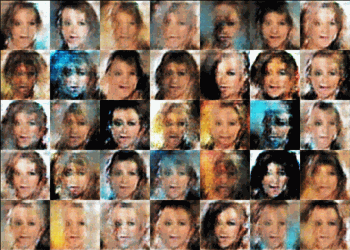

# DCGAN
Implementation of Deep Convolutional Generative Adversarial Network.

  

  

# Reference
- [Unsupervised Representation Learning with Deep Convolutional Generative Adversarial Networks](https://arxiv.org/abs/1511.06434) (ICLR 2016)