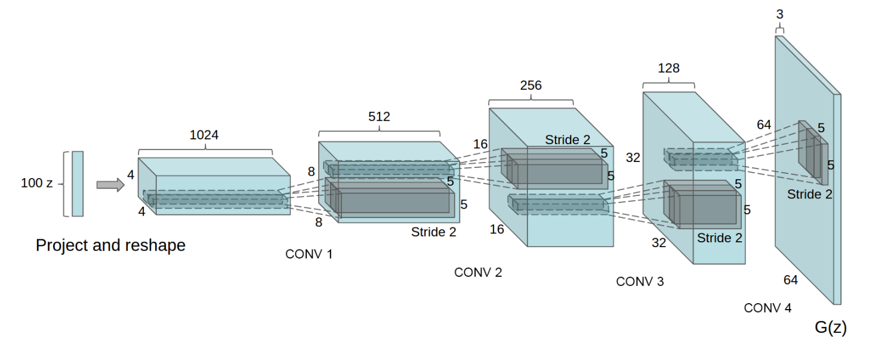

# DCGAN
Implementation of Deep Convolutional Generative Adversarial Network.

  

  

# Reference
- [Unsupervised Representation Learning with Deep Convolutional Generative Adversarial Networks](https://arxiv.org/abs/1511.06434) (ICLR 2016)
- [Generative Adversarial Nets](https://proceedings.neurips.cc/paper_files/paper/2014/hash/5ca3e9b122f61f8f06494c97b1afccf3-Abstract.html) (NIPS 2014)